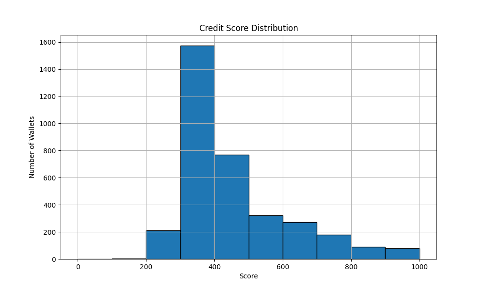

# Credit Score Analysis

## Score Distribution

### Score Buckets:
- **0–100**: Very risky wallets. Often liquidated, rarely repay loans.
- **100–200**: Risky behavior, low transaction activity.
- **200–500**: Moderate users. Some deposits and repayments, but inconsistent.
- **500–800**: Generally good users. Reliable deposits and repayments, rare liquidations.
- **800–1000**: Highly responsible wallets. Regular repayments, active deposits, no signs of exploitation.

## Observations
- Wallets in the **0–200 range** showed higher `liquidation_ratio` and lower `repay_ratio`.
- High scoring wallets rarely borrowed without repaying.
- A few wallets with low activity but no risky behavior scored moderately due to conservative scoring rules.

## Suggestions
- Incorporate transaction value in future versions.
- Temporal features (like wallet age or recency) could improve accuracy.
